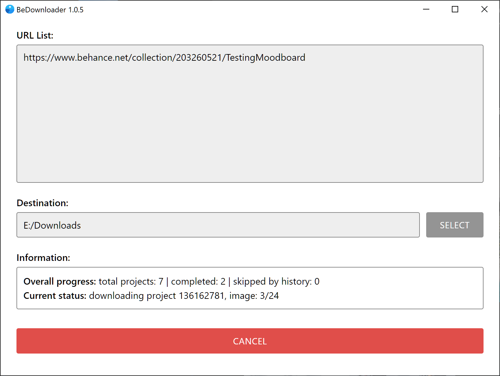

BeDownloader
===

Bulk image downloader for Behance URLs (projects, moodboards, profiles, likes, modules).\
Written with Electron, Playwright and other JS libraries.

## Features

* Parses provided URLs, finds projects, and then downloads all images from those projects.
* Downloads full-size original images if it available.
* Writes information about project into downloaded images (JPEG metadata).
* Keeps history for all downloaded projects.
* Has ability to skip downloading a project if its URL is found in history.
* Portable app, don't need installation.

## Usage as portable app (for Windows users only)

* Download portable app and run it

## Usage as Node.js project (for Windows, Linux and MacOS users)

```
1. Download and install Node.js v20.9.0 or newer.
2. Download repository archive and unpack it.
3. Go to unpacked folder and run "npm install" in terminal to install all project's dependencies.
4. Run "npm run dev" in terminal to start app.
```

## User options in config.ini file (in settings folder)

> **skipProjectsByHistory**\
> If set to "true" and you download a project that already exists in history.txt file, it will be skipped.\
> Default is "false".

> **downloadModulesAsGalleries**\
> If set to "true", all individual images saved in moodboards will be downloaded as a full projects with all images.\
> Default is "false".

> **showBrowser**\
> If set to "true", version of Chrome included with the app will be visible.\
> Chrome is used in app for scraping information from projects on Behance site.\
> Default is "true". If you don't need to see page navigation processes, just set it to "false".\ 

> **localStorageToken**\
> Required for downloading adult projects.\
> Default is "none". 


## Issues with downloading adult NSFW projects

Projects with adult content requires user authorization to access them.\
So, in this case, app requires your Behance account token to download these projects.\
Here instructions how to get it and use it with app:

* Login into your Behance account in your browser.
* Open Chrome DevTools (Ctrl+Shift+I).
* Navigate to "Local Storage" and copy token from it (as showed in
    [screenshot](screenshots/token_from_chrome.png)).
* Open "settings\\config.ini" and paste copied string into it (as showed in
    [screenshot](screenshots/token_in_config.png)).

After this you can launch app and download any projects.

## Screenshot

