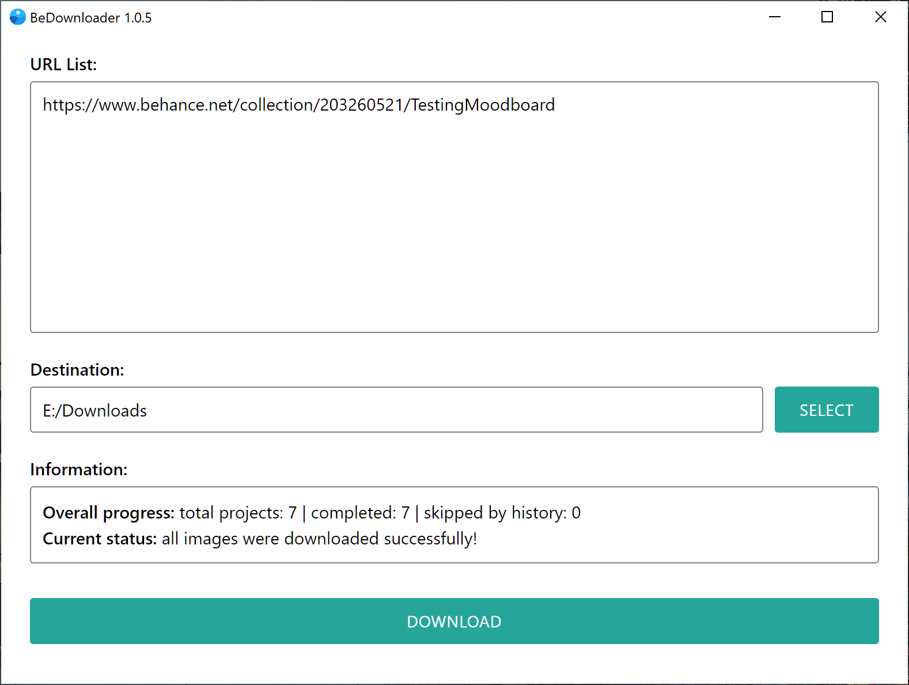

BeDownloader
==========================
Bulk image downloader for Behance URLs (projects, moodboards and profiles).  
Written with Electron, Puppeteer and other JS libraries.

## Features
- Downloads list of urls (projects and moodboards supported).
- Downloads full-size original images if it available.
- Writes information about project into downloades images (JPEG metadata).
- Keeps history for all downloaded projects.
- Has the ability to skip downloading a project if its URL is found in the history.
- Portable app, don't need installation.

## Usage
- Download portable app and run it.  
- Or download repository, install all dependencies, then run 'npm start' (for JS developers).

## Notes
- App settings and download history stored in {UserFolder}/.bedownloader  
- Skipping projects by download history can be disabled in config.ini

## Screenshot

## Todo
- Advanced settings in UI.
- Support for download all projects from profiles.
- Support for download embeded 360-degree panoramas from kuula.co.
- Mac and Linux versions.
