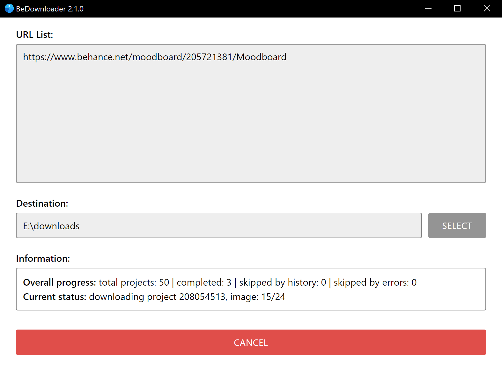

BeDownloader
==========================
Bulk image downloader for Behance URLs (projects, moodboards, profiles, likes).  
Written with Electron, Puppeteer and other JS libraries.

## Features
- Parses provided URLs, finds projects, and then downloads all images from those projects.
- Downloads full-size original images if it available.
- Writes information about project into downloaded images (JPEG metadata).
- Keeps history for all downloaded projects.
- Has ability to skip downloading a project if its URL is found in history.
- Portable app, don't need installation.

## Usage for Windows and Linux users
- Download portable app and run it.  
- Or, if you don't want to use compiled app, use the same instructions as for Mac users.

## Usage for Mac users
```
1. Download and install Node.js v18.16.0 or newer.
2. Download repository archive and unpack it.
3. Go to unpacked files and run 'npm i' to install all JavaScript dependencies.
3. Open 'app/js/config.js' and change 'const isDevMode = false' to true.
4. Run 'npm start' to start app.
```

## Notes
- App settings and download history stored in {OS UserFolder}/(.)bedownloader  
- Skipping projects by download history can be disabled in config.ini (true by default).

## Screenshot


## Todo
- Support for download embeded 360-degree panoramas from kuula.co.